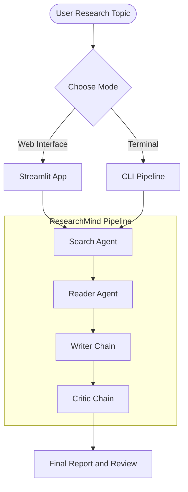
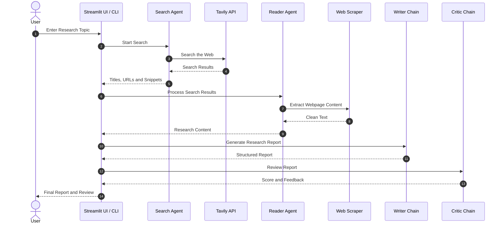

# ResearchMind – Multi-Agent AI Research System

ResearchMind is a multi-agent AI research system that automatically researches a topic and generates a structured report.

The system uses specialized AI agents for different tasks:

1. Search for relevant information on the web.
2. Read and extract useful content from webpages.
3. Generate a structured research report.
4. Review the report and provide quality feedback.

It is built using LangChain, OpenRouter, Tavily, Streamlit, and BeautifulSoup.

---

## How It Works

The research process follows a simple pipeline:

```text
User Topic
    ↓
Search Agent
    ↓
Web Search Results
    ↓
Reader Agent
    ↓
Extracted Web Content
    ↓
Writer Chain
    ↓
Research Report
    ↓
Critic Chain
    ↓
Final Report + Review Feedback
```

The project can be used through:

* A Streamlit web interface
* A command-line interface

---

# Architecture

## High-Level Workflow



---

# System Workflow

## Step 1: Search Agent

The Search Agent receives the research topic and searches the web for relevant and recent information.

It uses the Tavily Search API to find useful sources.

**Input:**

```text
Research Topic
```

**Output:**

* Search result titles
* URLs
* Short descriptions or snippets

Example:

```text
Topic:
"Impact of Generative AI on Software Development"

Search Agent:
    ↓

1. Article Title
2. URL
3. Search Snippet

1. Article Title
2. URL
3. Search Snippet
```

---

## Step 2: Reader Agent

The Reader Agent receives the search results.

It selects relevant webpages and uses a custom web scraper to extract useful content.

The scraper removes unnecessary elements such as:

* Navigation bars
* Scripts
* CSS styles
* Headers
* Footers

This creates cleaner text that can be passed to the LLM.

**Input:**

```text
Search Results
```

**Output:**

```text
Clean Webpage Content
```

---

## Step 3: Writer Chain

The Writer Chain combines:

* The user's research topic
* Search results
* Extracted webpage content

It then generates a structured research report.

The report contains:

1. Introduction
2. Key Findings
3. Conclusion
4. Sources

The Writer Chain is built using LangChain Expression Language (LCEL).

```text
Prompt
   |
   v
LLM
   |
   v
Output Parser
```

---

## Step 4: Critic Chain

The Critic Chain reviews the generated research report.

It evaluates the quality of the report and provides constructive feedback.

The output includes:

* Score out of 10
* Strengths
* Areas for improvement
* Final verdict

Example:

```text
Score: 8/10

Strengths:
- Well-structured report
- Relevant information
- Clear conclusion

Areas to Improve:
- Add more primary sources
- Include additional data or statistics

Verdict:
A strong report with minor areas for improvement.
```

---

# Agent Interaction Flow



---

# Components

| Component     | Type          | Purpose                                    |
| ------------- | ------------- | ------------------------------------------ |
| Search Agent  | AI Agent      | Searches the web for relevant information  |
| Reader Agent  | AI Agent      | Reads webpages and extracts useful content |
| Writer Chain  | LCEL Chain    | Generates the research report              |
| Critic Chain  | LCEL Chain    | Reviews and evaluates the report           |
| Tavily        | Search API    | Provides web search results                |
| BeautifulSoup | Web Scraper   | Extracts clean text from webpages          |
| Streamlit     | Web Framework | Provides the user interface                |

---

# Features

## Multi-Agent Workflow

ResearchMind uses multiple AI agents that work together in a sequential pipeline.

Each component has a specific responsibility.

```text
Search → Read → Write → Review
```

---

## Real-Time Web Search

The system uses Tavily to search for recent and relevant information from the web.

This allows the research report to use information beyond the model's existing knowledge.

---

## Webpage Content Extraction

The Reader Agent uses BeautifulSoup to extract useful text from webpages.

Unnecessary HTML elements are removed before sending the content to the language model.

---

## Structured Research Reports

The Writer Chain generates reports with a clear structure:

```text
Introduction
↓
Key Findings
↓
Conclusion
↓
Sources
```

---

## Report Quality Review

The Critic Chain evaluates the generated report and provides feedback to improve its quality.

---

## Streamlit Web Interface

The project includes a Streamlit interface where users can:

* Enter a research topic
* Run the complete research pipeline
* View results from each stage
* Read the final report
* View critic feedback
* Download the report as a Markdown file

---

## Command-Line Support

The pipeline can also be executed directly from the terminal.

This is useful for testing and debugging individual stages of the system.

---

# Project Structure

```text
Multi_agent/

├── app.py
├── pipeline.py
├── agents.py
├── tools.py
├── requirements.txt
├── .env
└── README.md
```

### `app.py`

Contains the Streamlit web interface.

It handles:

* User input
* Pipeline execution
* Progress display
* Report rendering
* Markdown download

### `pipeline.py`

Contains the main research pipeline.

It coordinates the complete workflow:

```text
Search
   ↓
Read
   ↓
Write
   ↓
Review
```

### `agents.py`

Contains:

* Search Agent
* Reader Agent
* Writer Chain
* Critic Chain

### `tools.py`

Contains custom tools used by the agents.

Examples:

* `web_search`
* `scrape_url`

### `requirements.txt`

Contains all required Python packages.

### `.env`

Stores API keys and environment variables.

Example:

```env
OPENROUTER_API_KEY=your_api_key

TAVILY_API_KEY=your_api_key
```

---

# Installation

## Prerequisites

Before running the project, make sure you have:

* Python 3.10 or later
* OpenRouter API key or OpenAI API key
* Tavily API key

---

## 1. Clone or Download the Project

Navigate to the project directory:

```bash
cd Multi_agent
```

---

## 2. Create a Virtual Environment

### Windows

```powershell
python -m venv .venv
```

Activate it:

```powershell
.\.venv\Scripts\Activate.ps1
```

### Linux or macOS

```bash
python3 -m venv .venv
```

Activate it:

```bash
source .venv/bin/activate
```

---

## 3. Install Dependencies

```bash
pip install -r requirements.txt
```

---

## 4. Add API Keys

Create a `.env` file in the project folder.

```env
OPENROUTER_API_KEY=your_openrouter_api_key

TAVILY_API_KEY=your_tavily_api_key
```

Do not upload your `.env` file to GitHub.

You can add it to `.gitignore`:

```text
.env
.venv/
__pycache__/
```

---

# Running the Project

## Option 1: Streamlit Web Interface

Run:

```bash
streamlit run app.py
```

After starting the application, Streamlit will open the project in your browser.

By default, it usually runs on:

`http://localhost:8501`

Enter a research topic and click:

```text
Run Research Pipeline
```

The system will then:

1. Search the web.
2. Extract webpage content.
3. Generate a research report.
4. Review the report.
5. Display the final result.

---

## Option 2: Command Line Interface

Run:

```bash
python pipeline.py
```

Enter your research topic when prompted.

The pipeline will execute each stage and display the results in the terminal.

---

# Customization

## Change the LLM Model

You can change the model inside `agents.py`.

Example using `ChatOpenAI`:

```python
from langchain_openai import ChatOpenAI
import os

llm = ChatOpenAI(
    model="gpt-4o",
    api_key=os.getenv("OPENAI_API_KEY"),
    temperature=0,
)
```

You can also configure a model through OpenRouter depending on your project setup.

---

## Change Search Results

You can modify the number of search results returned by the Tavily search tool.

For example:

```python
results = tavily.search(
    query=query,
    max_results=5
)
```

Change `max_results` depending on how much research context you want to collect.

---

## Change Scraped Content Length

The Reader Agent currently limits the extracted webpage content before passing it to the language model.

For example:

```python
content = content[:3000]
```

You can increase or decrease this value depending on:

* Token limits
* API costs
* Required research depth

---

# Example Workflow

Suppose the user enters:

```text
How is Generative AI changing software development?
```

The system performs the following steps:

```text
User Topic
    ↓
Search Agent searches the web
    ↓
Relevant articles and sources are collected
    ↓
Reader Agent extracts detailed webpage content
    ↓
Writer Chain creates a structured report
    ↓
Critic Chain evaluates the report
    ↓
Final Report + Quality Feedback
```

---

# Tech Stack

**AI and Agent Framework**

* LangChain
* LangChain Expression Language (LCEL)
* ReAct Agents

**LLM Provider**

* OpenRouter
* OpenAI-compatible models

**Search**

* Tavily Search API

**Web Scraping**

* Requests
* BeautifulSoup4

**Frontend**

* Streamlit

**Language**

* Python

---

# Future Improvements

Possible improvements for ResearchMind include:

* Research from multiple webpages instead of a single URL.
* Parallel execution for faster research.
* Source citations inside generated reports.
* Support for PDF and document research.
* Persistent research history.
* Vector database for long-term research memory.
* Follow-up questions on completed research.
* Export reports as PDF or DOCX.
* More advanced report evaluation metrics.
* Multi-agent planning before starting research.

---

# Summary

ResearchMind demonstrates how multiple AI agents and LCEL chains can work together to automate a research workflow.

Instead of relying on a single LLM prompt, the system divides the task into specialized stages:

```text
Search Agent
    ↓
Reader Agent
    ↓
Writer Chain
    ↓
Critic Chain
```

This separation makes the workflow easier to understand, maintain, and extend.

ResearchMind can be used as a foundation for building more advanced AI research assistants, autonomous agent systems, and multi-agent workflows.
